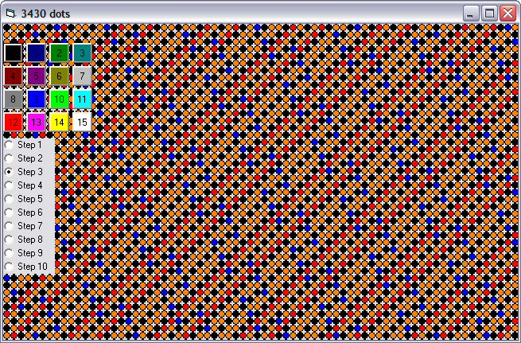



## Control Array Grids

### Description

What do you do if you need a grid of controls? You can painstakingly draw them one by one in the IDE carefully sizing and placing each one OR use a computer to do it for you!

This demo uses a form with 3 controls on it and a simple procedure (GenerateGrid) to create a program with 3456 (even more if you maximize the form; 16415 dots + the 26 other controls on my system) controls.

To use this code simply create one control with the properties you wish to share (size, colour and shape are the usually ones) and set its Index to 0. This becomes the root control for the array. Place it on the form at the Top-Left position of your grid. Call the routine.

I recommend this for creating tile based games where the positon and contents of the tile are not likely to change most of the time.

While I use it as a graphics display in this demo I do not recommend it because control-based 'pixels' are very slow to create and manipulate as you can see in the demo if you maximize the form (and wait.. and wait... while it creates the controls) .
 
### More Info
 

             |
---                |---
**Submitted On**   |2006-01-03 22:30:04
**By**             |[Roger Gilchrist](https://github.com/Planet-Source-Code/PSCIndex/blob/master/ByAuthor/roger-gilchrist.md)
**Level**          |Beginner
**User Rating**    |4.9 (39 globes from 8 users)
**Compatibility**  |VB 5\.0, VB 6\.0
**Category**       |[Games](https://github.com/Planet-Source-Code/PSCIndex/blob/master/ByCategory/games__1-38.md)
**World**          |[Visual Basic](https://github.com/Planet-Source-Code/PSCIndex/blob/master/ByWorld/visual-basic.md)
**Archive File**   |[Control\_Ar196207132006\.zip](https://github.com/Planet-Source-Code/roger-gilchrist-control-array-grids__1-63909/archive/master.zip)

